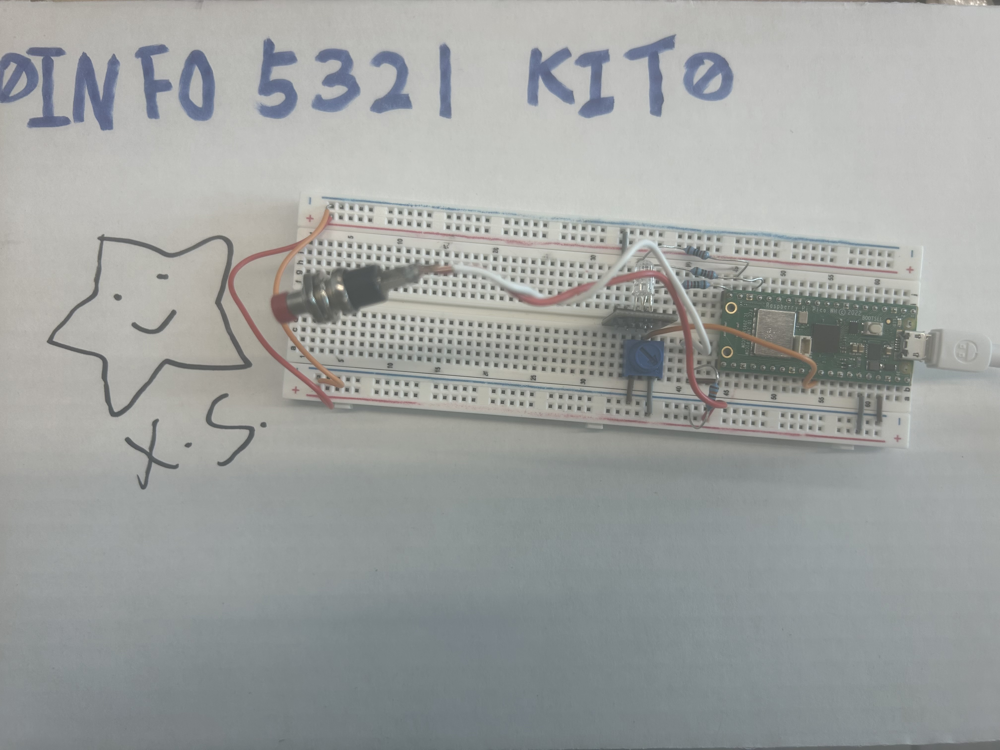

# 🚨 Ambient Trello Aura


**Ambient Trello Aura**: A desktop companion that translates Trello task deadlines into dynamic RGB lighting, helping users visualize workload pressure and manage digital anxiety. (Built with Raspberry Pi Pico W and RGB LEDs)

## 💡 Idea
The inspiration for this project stemmed from extensive experience utilizing project management tools like Trello, as well as prior development of Discord bots for automated notifications. The primary goal was to bridge the gap between digital workflows and the physical environment—creating a dedicated, aesthetic desk accessory that provides real-time project awareness without relying on a browser window or chat interface.

## 📁 Project Structure

- `docs/`: Design documents and technical notes.
- `RGB_LED/`: Arduino/C++ source code for the Pico W.
- `Processing_Connect/`: Alt wired internet connection mode using Processing.
- `tests/`: API verification and testing scripts (Python/JS).

## ⚙️ Hardware Components

- Raspberry Pi Pico W
- RGB LED (Common Cathode)
- Potentiometer 
- Push Button (with 10KΩ / 100KΩ Pull-down Resistor)
- 3× 220Ω Resistors (for RGB LED current limiting)
- Breadboard and jumper wires

### Initial Design vs. Final Implementation
Due to project time constraints and to ensure code stability, two initially planned components were excluded from the final build to focus effort on software reliability:
1. **Photoresistor (LDR)**: Intended for adaptive LED brightness. Tests showed marginal visual improvements that did not justify the added code complexity.
2. **Ultrasonic Sensor**: Intended to detect user presence (automatic sleep when no one is at the desk). The sleep functionality is now reliably handled manually via the Push Button.

## 💡 Pin Mapping Reference


> This design remains unchanged, Potentiometer is still on GP 26. 

*Current Implementation*

| Component         | Pico W Pin                   | Note           |
| ----------------- | ---------------------------- | -------------- |
| **RGB LED**       | GP13 (R), GP14 (G), GP15 (B) | PWM Support    |
| **Potentiometer** | GP26 / GP27                  | Analog Input   |
| **Button**        | GP16                         | Pull-down Res. |

### Previous Design Iterations
<details>
<summary>Click to view previous circuit versions</summary>


*Version 2 - Included unused sensor wiring*
</details>

## 📡 API Integration

This project uses the **[Trello API](https://developer.atlassian.com/cloud/trello/guides/rest-api/api-introduction/)** to monitor project changes and provide visual feedback via the RGB LED.

## 💻 Development Environment

- **Primary IDE**: Arduino IDE (for Pico W Sketch)
- **Secondary IDE**: VS Code (for documentation and API testing)
- **Platform**: Raspberry Pi Pico W 

## ⭐ Getting Started

### 1. Clone the Repository
```bash
git clone https://github.com/XXXStars0/Project-LED-Light.git
cd Project-LED-Light
```

### 2. Hardware Assembly
Carefully assemble the components on your breadboard according to the **[Pin Mapping & Circuit Diagram](#-pin-mapping-reference)** provided above. Ensure the 220Ω current-limiting resistors are correctly placed for the RGB LED to prevent board overheating or short circuits.

### 3. Software Setup (Arduino Wi-Fi Mode)
1. Install the **Raspberry Pi Pico/RP2040** board support in the Arduino IDE.
2. Open the sketch located at `RGB_LED/RGB_LED.ino`.
3. Configure your Wi-Fi credentials and Trello API keys in `RGB_LED/wifi_config.h` and the corresponding secrets file.
4. Upload the sketch to the Pico W.

### API Testing Setup (Python)
If need to test the Trello API using the provided Python scripts in `tests/`:

1. Install the required dependencies:
   ```bash
   pip install python-dotenv requests
   ```
2. Create a `.env` file in the root directory and add Trello API credentials:
   ```env
   TRELLO_API_KEY=your_api_key_here
   TRELLO_TOKEN=your_oauth_token_here
   TRELLO_BOARD_ID=your_board_id_here
   ```
3. Run the test script: 
   ```bash
   python tests/trello_api_test.py
   ```

   **💡 Note:** In line 29 of `trello_api_test.py` (`selected_list = trello_lists[0]`), is possible to configure the specific list to track by changing the index (0 represents the first list).

   **Example Output of Testing Script:**
   ```text
   ---> Simulating potentiometer input: Currently tracking list 'To Do'
   
   There are 1 cards in this list. Starting pressure value calculation...
   
      Card: Test 1
       Status: No due date -> Pressure +1
   
   ========================================
   Total pressure score for the current list: 1
   Pico W Pin PWM Output Instructions:
      -> 🔴 GP13 (Red):   5
      -> 🟢 GP14 (Green): 249
      -> 🔵 GP15 (Blue):  0
   ```

### Wired Connection Setup (Processing)
An alternative wired mode is available using Processing to fetch the Trello API and communicate with the Pico W directly via Serial (USB). This allows the computer to handle API requests instead of the Pico W's Wi-Fi.

1. Open `RGB_LED/wifi_config.h` and comment out the line: `// #define USE_WIFI_MODE`.
2. Upload the `RGB_LED.ino` sketch to the Pico W using Arduino IDE.
3. Keep the Pico W connected to your computer via USB.
4. Open the `Processing_Connect/Processing_Connect.pde` sketch in the [Processing IDE](https://processing.org/).
5. Check your Arduino IDE to see which COM port the Pico W is using, and update the `COM_PORT` variable in the Processing sketch accordingly (e.g., `"COM4"`).
6. Run the script in Processing. It will automatically read your API credentials from the root `.env` file, read potentiometer data sent from the Pico W, and send back realtime RGB color values!

## 🧰 Usage Instructions

### Controls
- **Button (GP16):**
  - **Short press (< 300ms):** Force refresh the current list data.
  - **Long press (≥ 300ms):** Toggle sleep mode (LEDs turned off).
- **Potentiometer (Knob):** Rotate to scroll through Trello lists. The system detects index changes (Edge Detection) and instantly triggers a data fetch. 
- **Wake:** When in Sleep mode, either pressing the button or rotating the potentiometer will immediately awaken the device and resume tracking.

### Visual Status Indicators (LED)
The Pico W uses dual-core architecture for non-blocking LED animations (Core 1) during API requests (Core 0):
- ⚪ **BOOTING / LOADING:** White breathing effect. Startup or fetching new data.
- 🔴 **ERROR:** Rapid red double-blink. Wi-Fi disconnection or API failure.
- ⚫ **SLEEP:** LEDs off. Power-saving mode.
- **TRACKING:** Solid color based on accumulated "Pressure Score" (card due dates):
  - 🔵 **Blue:** Idle / Empty list.
  - 🟢 **Green:** Low pressure.
  - 🟡 **Yellow:** Medium pressure.
  - 🔴 **Red:** High pressure (urgent/overdue).

## 🛠️ Troubleshooting & Fixes

- **Wired Mode Sleep Failure When Disconnected:**
  - *Issue:* In early iterations, the button logic simply sent sleep commands to the Processing sketch. If the computer was disconnected, the Pico W failed to enter sleep mode.
  - *Fix:* Shifted the sleep state management directly into the Pico W's local loop logic, ensuring independent operation regardless of the Serial connection status.

- **Pico W Not Reading Potentiometer Data:**
  - *Issue:* The board and wiring appeared correct, but no potentiometer readings were registered.
  - *Fix:* Discovered the potentiometer was mistakenly connected to the `RUN` (reset) pin instead of the designated `GP26` analog input pin. Reconnecting resolved the issue.

- **Pico W Board Overheating:**
  - *Issue:* The RGB LED caused a short circuit, resulting in rapid overheating of the Pico W board.
  - *Fix:* Added **220Ω resistors** to the RGB LED circuits to limit current draw, successfully preventing short circuits and excessive heat.

- **USB Disconnect at Low Potentiometer Values (GP26):**
  - *Issue:* When the potentiometer was connected to `GP26` and rotated to near-minimum values, the USB Serial connection between the Pico W and the computer would drop unexpectedly.
  - *Fix:* Relocated the potentiometer signal wire from `GP26` to `GP27`. The exact root cause on `GP26` remains unclear, but the issue has not reoccurred on `GP27`.
