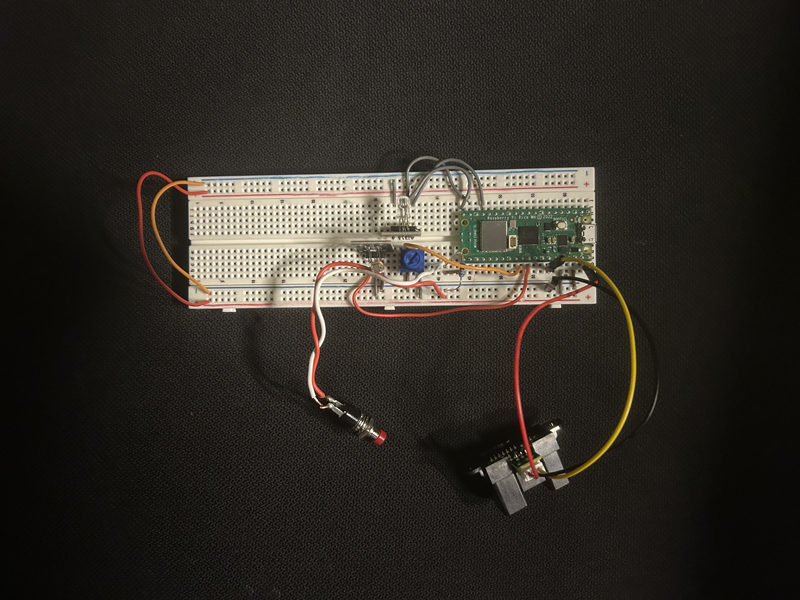

# 🚨 Project LED Light


A Technical mini-project using Raspberry Pi Pico W and RGB LEDs. This project connects to an API to receive data and provides visual feedback through LED lighting.

## 📁 Project Structure

- `docs/`: Design documents and technical notes.
- `src/`: Arduino/C++ source code for the Pico W.
- `tests/`: API verification and testing scripts (Python/JS).

## ⚙️ Hardware Components

- Raspberry Pi Pico W
- RGB LED (GP13, GP14, GP15)
- Potentiometer (GP26)
- Ultrasonic Sensor (GP28)
- Button (GP16 + 100KΩ Resistor)
- Photoresistor (GP27)
- Breadboard and jumper wires

## 💡 Pin Mapping Reference



| Component         | Pico W Pin                   | Note           |
| ----------------- | ---------------------------- | -------------- |
| **RGB LED**       | GP13 (R), GP14 (G), GP15 (B) | PWM Support    |
| **Potentiometer** | GP26                         | Analog Input   |
| **Ultrasonic**    | GP28 / Pin 34                |                |
| **Button**        | GP16                         | 100KΩ Resistor |
| **LDR**           | GP27                         |                |

## 📡 API Integration

This project uses the **[Trello API](https://developer.atlassian.com/cloud/trello/guides/rest-api/api-introduction/)** to monitor project changes and provide visual feedback via the RGB LED.


## 💻 Development Environment

- **Primary IDE**: Arduino IDE (for Pico W Sketch)
- **Secondary IDE**: VS Code (for documentation and API testing)
- **Platform**: Raspberry Pi Pico W 

## ⭐ Getting Started

### Hardware Setup (Arduino)
1. Install the Raspberry Pi Pico W board support in Arduino IDE.
2. Open the sketch in `src/`.
3. Configure your Wi-Fi credentials in `secrets.h`.
4. Upload the sketch to the Pico W.

### API Testing Setup (Python)
If need to test the Trello API using the provided Python scripts in `tests/`:

1. Install the required dependencies:
   ```bash
   pip install python-dotenv requests
   ```
2. Create a `.env` file in the root directory and add Trello API credentials:
   ```env
   TRELLO_API_KEY=your_api_key_here
   TRELLO_TOKEN=your_oauth_token_here
   TRELLO_BOARD_ID=your_board_id_here
   ```
3. Run the test script: 
   ```bash
   python tests/trello_api_test.py
   ```

   **💡 Note:** In line 29 of `trello_api_test.py` (`selected_list = trello_lists[0]`), is possible to configure the specific list to track by changing the index (0 represents the first list).

   **Example Output of Testing Script:**
   ```text
   ---> Simulating potentiometer input: Currently tracking list 'To Do'
   
   There are 1 cards in this list. Starting pressure value calculation...
   
      Card: Test 1
       Status: No due date -> Pressure +1
   
   ========================================
   Total pressure score for the current list: 1
   Pico W Pin PWM Output Instructions:
      -> 🔴 GP13 (Red):   5
      -> 🟢 GP14 (Green): 249
      -> 🔵 GP15 (Blue):  0
   ```
